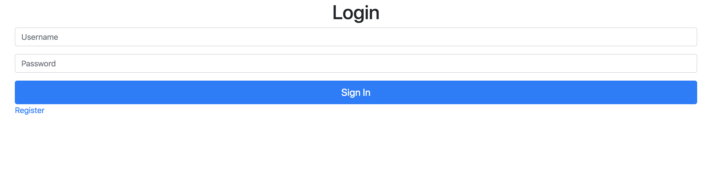
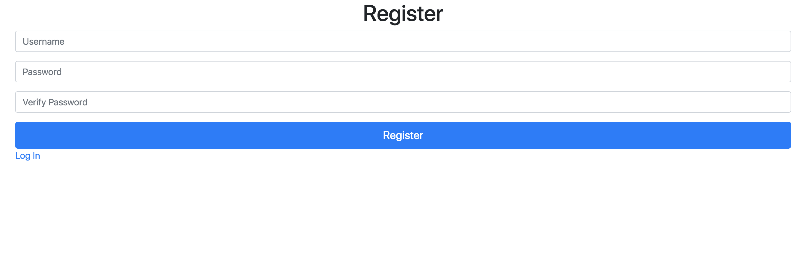
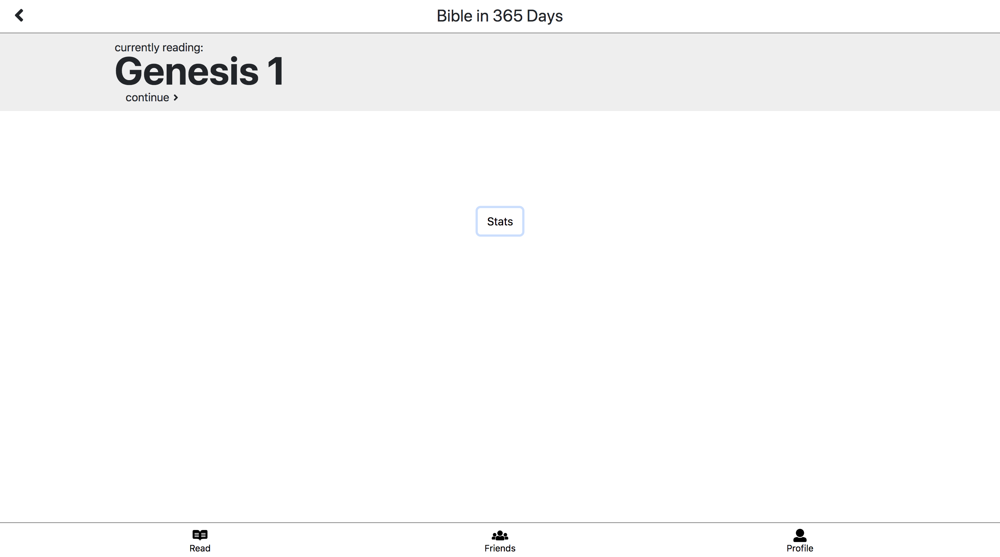
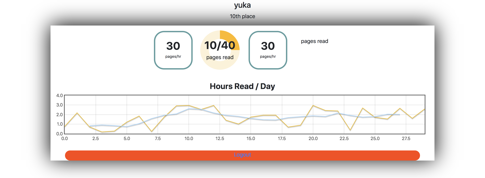
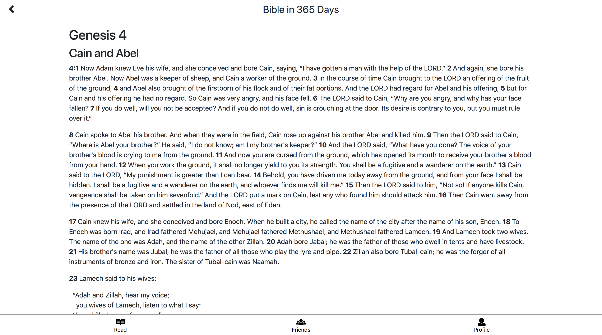
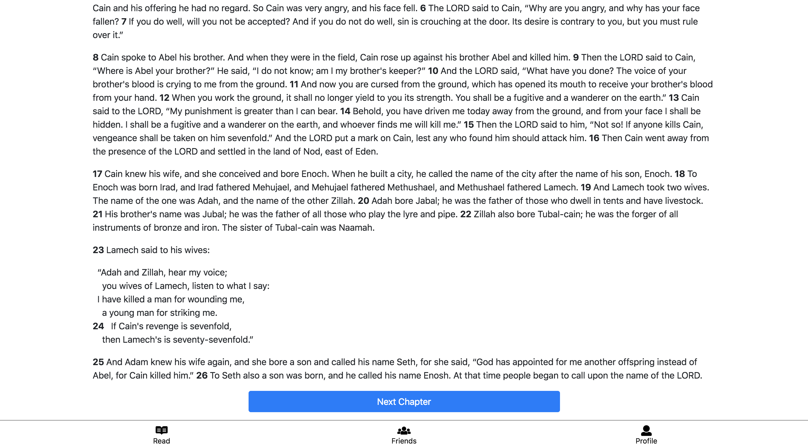
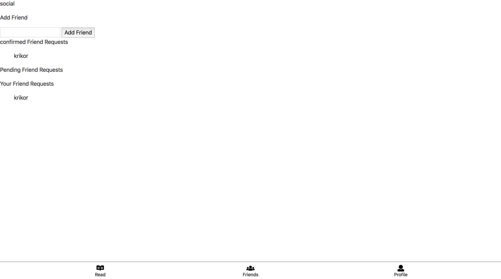
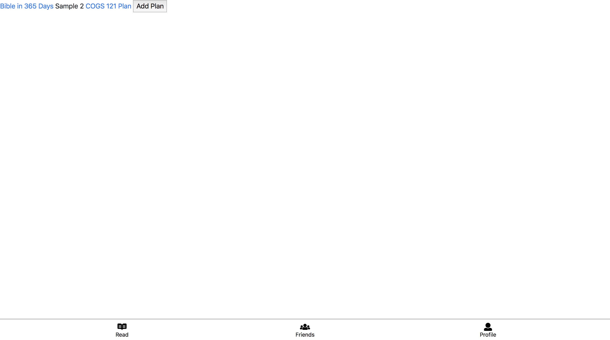

# Team Klesis #

## Screenshots ##
Login Screen

Register Screen

Home Screen

Profile Screen

Reading Page

Add Friend Page

Add Plan Page

## Differences From Milestone 3 ##
For the reading plan page, which is the homepage of our web app, we displayed where the user has left off and allows the user to continue reading. By clicking “continue” the user will see the read page which contains the text for a specific chapter and a “Next Chapter” button. For the profile page, we added a graph of hours read per day and changed the design of the user statistics. For the log-in page, we added the ability to create an account by clicking “Register”. Overall, we added a navbar at the button with icons and labels for the three main pages of our app and we also created a color scheme that it mostly white with blue accents.  

## User Security ##
We are using MongoDB so that we can have complete control over all the data our users choose to share with us. Most of the data is not inherently compromising, and actually our app is designed to promote sharing of data, however, we understand that users may not want to share data with just anyone. As a result we chose to make the design decision of limiting control of data a given user can see. One key feature which we decided to implement first so that it could be the basis of our data sharing capabilities was the friends system. In our friends system we require a user to confirm a friend request. A given user can send anyone a friend request however we will not allow that user to see that “friends” data until  the friend has responded by adding the user back, i.e. confirming the friend request. Thus, only people who you explicitly have added can see your data, making sure it is safe and not being absorbed by big Z U C C.

