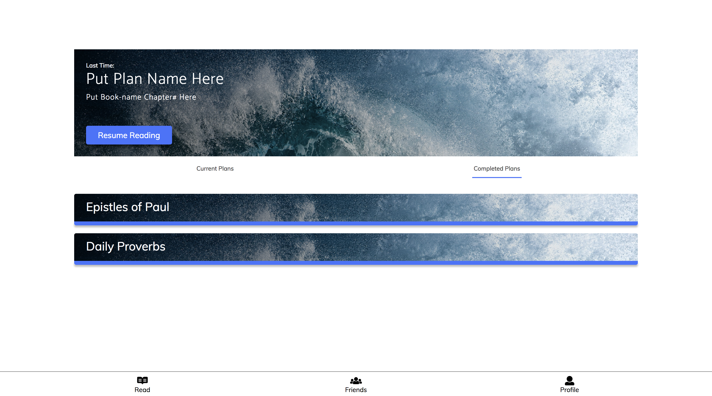
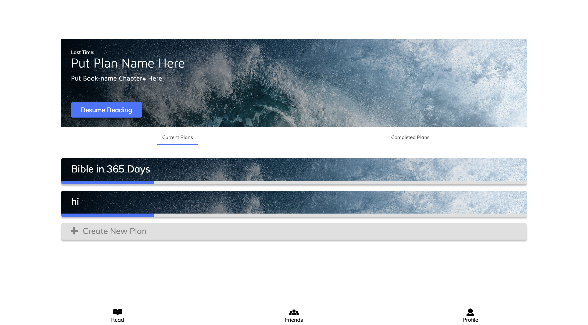
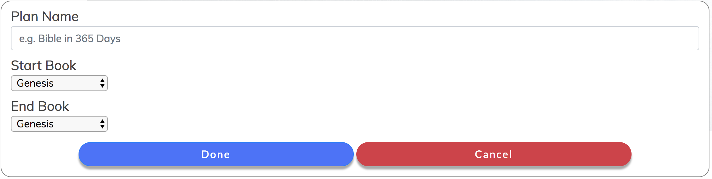
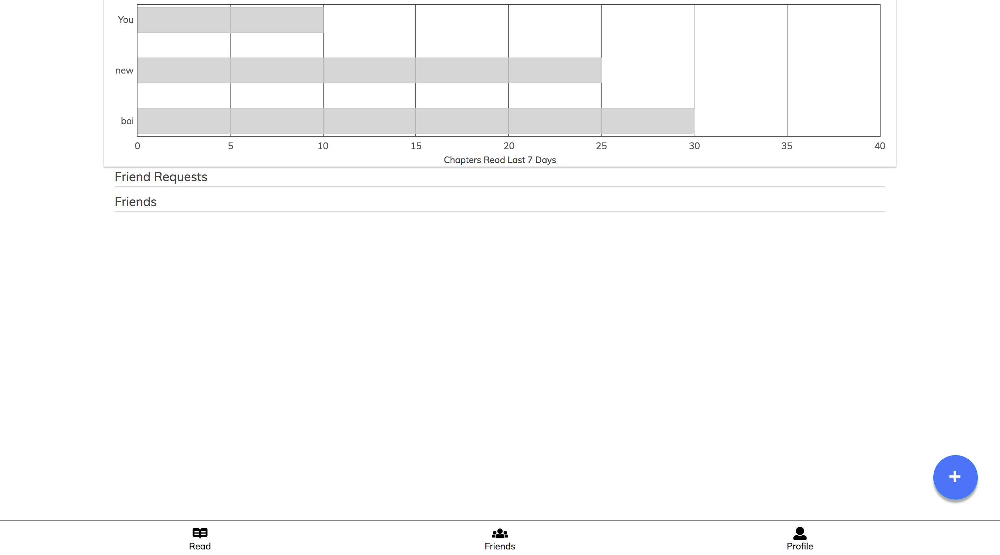

# Milestone 5 #

## Screenshots of the UI ##
Current Plans Homepage

Completed Plans Homepage

Single Plan Stats

Create New Plan

Friends Page

## Description of UI differences ##
We updated the UI for 3 pages of the app. We updated the homepage to contain a header section with a background image that shows which plan and chapter the user last left off. This section also includes a button allows the user to resume the text that they last left off (this button was previously a link). We also divided the plans on the homepage into current plans and completed plans (see homepage - current plans.png and homepage - completed plans.png). Each plan can also have its own image associated with it. Additionally on the homepage, there is a create new plan button that allows the user to create a plan by choosing the start and end point (see create new plan.png). When the user clicks on one plan, it leads to a page that shows the reading stats and friends list for that plan (see single plan (stats).png). The reading stats are displayed with circular progress bars (similar to pie charts) and icons to help quickly distinguish different info. Lastly, on the friends page, we included a graph that compares the number of chapters you read in the past week compared with all of your friends (see friends.png). 

## Non-Trivial Action 1 ##
The first non-trivial action on our app that you can do is pull up text from the bible. To
do this:
1. Login w/ username: me , password: me
2. Click on "Bible in 365 Days"
3. On the details page, click on "continue"
4. Scroll to the bottom to get to the next chapter

Now you can see that we are able to read the bible text from our app.

This adds to our main functionality because we need to be able to read the bible directly, thus we need to be able to pull the text from the bible. This is problably the most important functionality regarding our web-app since it is bible reading.

## Non-Trivial Action 2 ##
The second-trivial action on our app that you can do is add friends. To do this:

1. Login w/username: me, password:me
2. Click on the "friends" tab at the bottom
3. Fill out the form and confirm the request.
4. To fully check this, the other person must be on their computer as well. 
5. To check on this, please accept the pending friend request.

This adds to our main funtionality because we want to be able to compare the user's bible reading with their friends. For this reason, we need a friend system which this non-trivial action benefits.