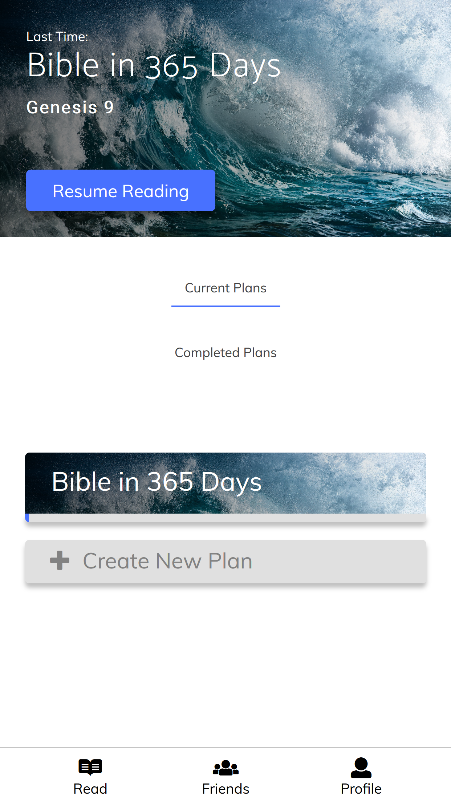
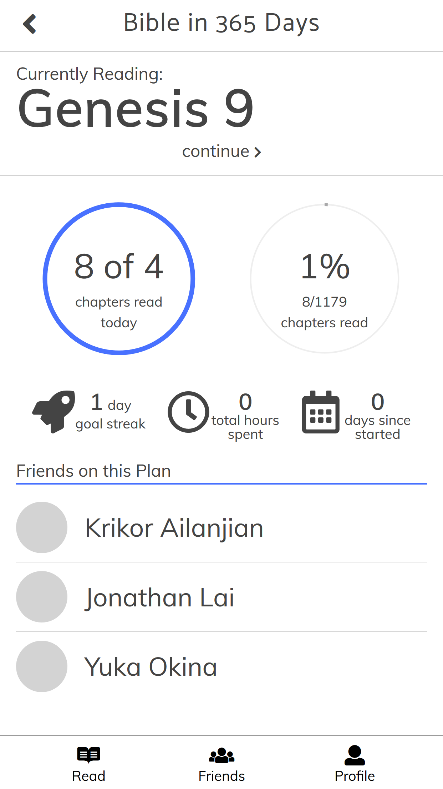
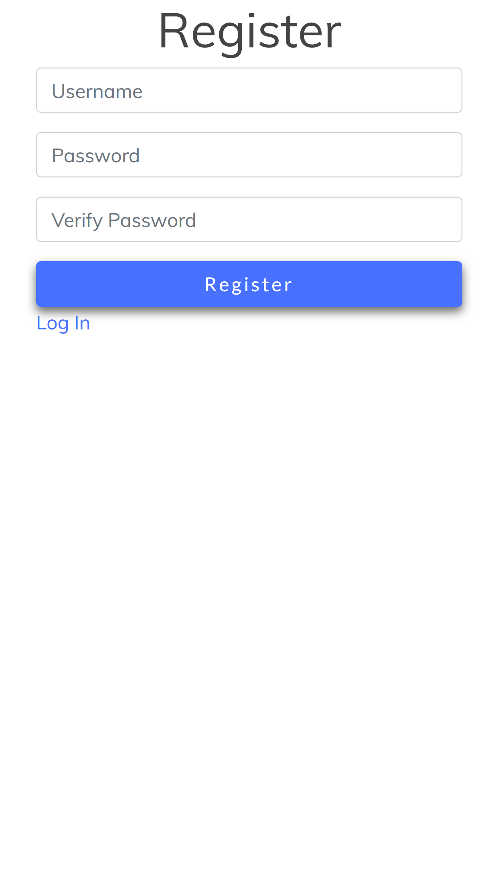
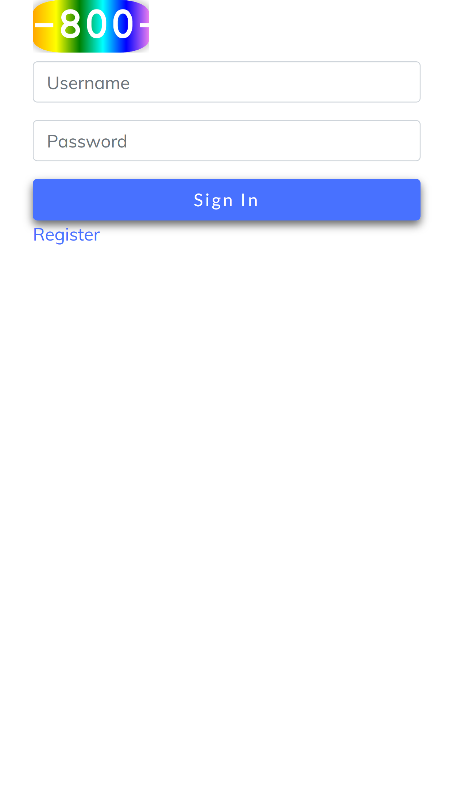
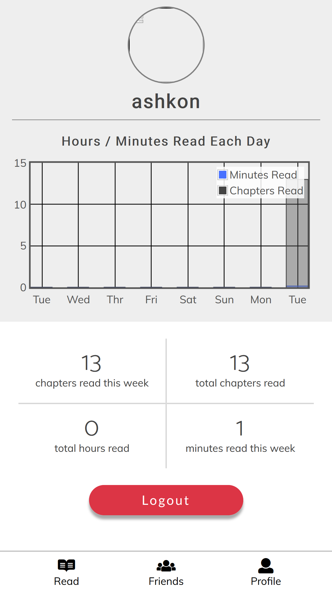
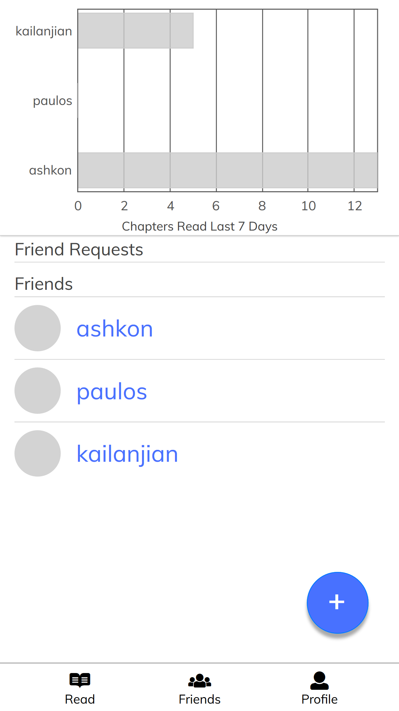

# Milestone 6#

## Screenshots of the UI ##
Current Plans Homepage

Single Plan Page

Register Plan Page

Login Page

Profile Page

Friends Page

## Description of UI differences ##
We updated the UI for the friends and profile page. On the friends page, we included a
graph that compares the user overall chapters read with all of their friends and the add
friend button was changed to an icon. This button leads to a new page that allows the user
to search and add new friends and see incoming and outgoing friend requests. We also added
the functionality to see a friend’s profile page by clicking on their name. On the profile
page, we included a graph of the user’s chapters read each day of the week and organized 
the other stats in a table. 
## Screenshots of Data Visualizations ##
Friends Page

Profile Page

Plans Page

Single Plan Page

## Description Of Data Visualizations ##
On Friends Page:
- We have a visualization of each friends completed chapters in the last 7 days. It is charted horizontally with the progress, in number of chapters for each user in the last 7 days.

On Profile Page:
- We have a visualization of minutes and chapters read for the user for each day of the week for the last 8 days. This chart is pretty self-explanatory. We chose to display both chapters and minutes because we tracked both metrics separately and we thought both might be useful to a user. Since it can be expected that a user will probably spend about a minute per chapter or some multiple of that, (maybe at most 5 or 10 minutes) we charted both in a single graph.
- We also have a text display of the user's total progress in terms of time spent and chapters and weeks progress so the user can have quick access to that data.

On Plans Page:
- Under each plan we have a blue bar representing progress on the plan.

On Read Page:
- We have a display of daily progress (chapters read today out of the goal). It is represented by a circle which fills up blue when it is done.
- We have a parallel display for total progress.
- Text displays of the current streak, hours spent and days since start of plan.
