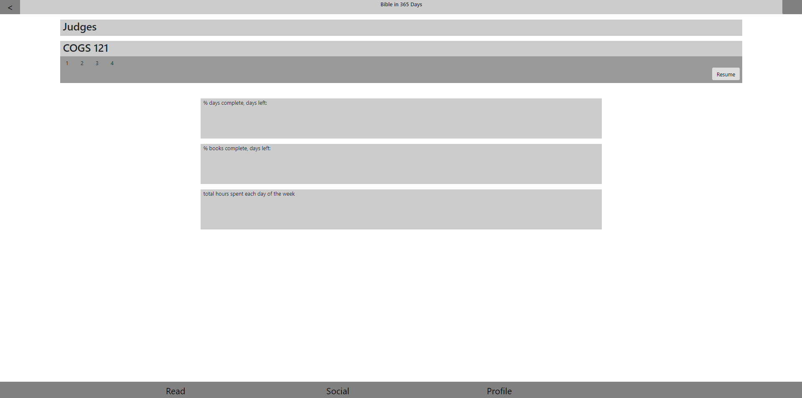
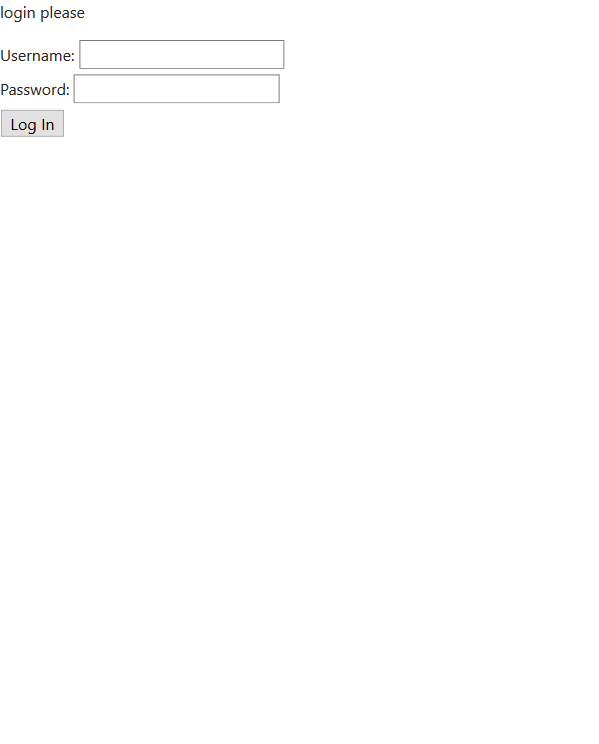
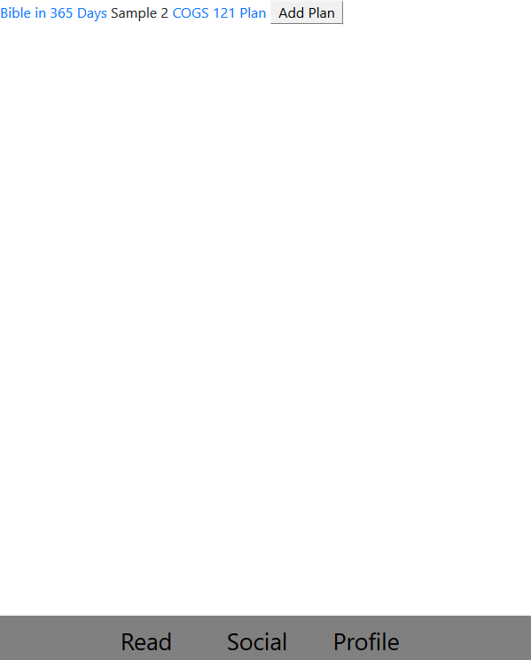
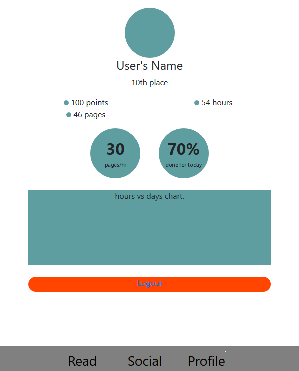
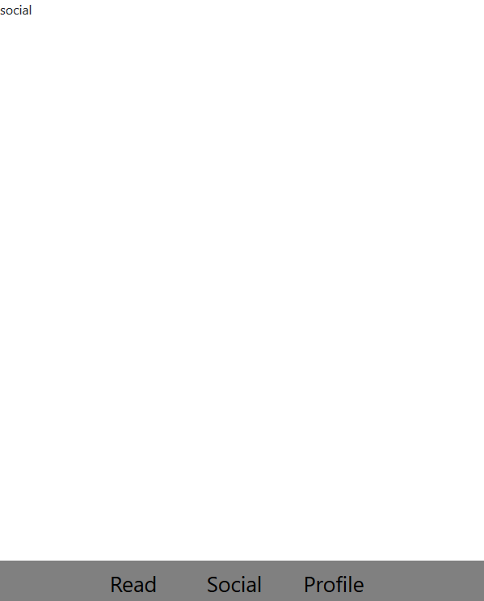

# Team Klesis #
## Screenshots of Skeleton ##
### Home Page ###

### Login Page ###

### Plan Page ###

### Profile Page ###

### Social Page ###

## Differences between UI skeleton and markdown 2 ##

Overall:
Based on the feedback of our IA, we took out the edit/set plan feature from both prototypes because our IA mentioned that users may feel pressured about what chapters to read and it doesn’t offer the flexibility to skip around different chapters. We also took out the social features from prototype #2 because it is not necessary for the primary function of the app which allows for in-app reading and tracking of progress. Instead, we will make this a stretch goal.

For homepage:
We decided that the reading plan you last left off on will be the homepage which is similar to the dashboard page from prototype #1 and read page from prototype #2. However, the difference is that the overall progress and stats for the current reading plan can be seen by pressing the stats button instead of a static display of them. This is because the primary function is reading so the user may not be interested in seeing the overall stats every time they open the app and it also reduces visual clutter for the homepage. Another difference is that the read button will be included in the chapter instead of above all the chapters (prototype #2) so that users will know where they left off (feature of dashboard in prototype #1). However, similar to prototype #2, the homepage will have chapters names which will still show the progress for that chapter so the user can quickly see where they left off. 

For friends page:
We decided to simply the social page from prototype #2 to a friends list more like in prototype #1 but without the graph so that the user can still see a quick overview of their friends stats in order to create  competition and foster motivation to read.

