# Team Klesis #

## StoryBoard #1: Motivation by Competition ##
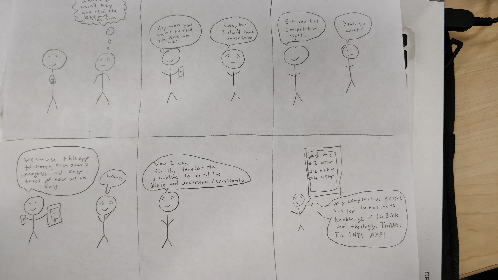

**Description**: The person in the story above is struggling to be motivated to do bible reading. The solution is to have a friend who can keep them accountable. Through the app, they will be able to set-up challenges with each other and compare where they are at which adds a shame/pride factor between them.

## StoryBoard #2:
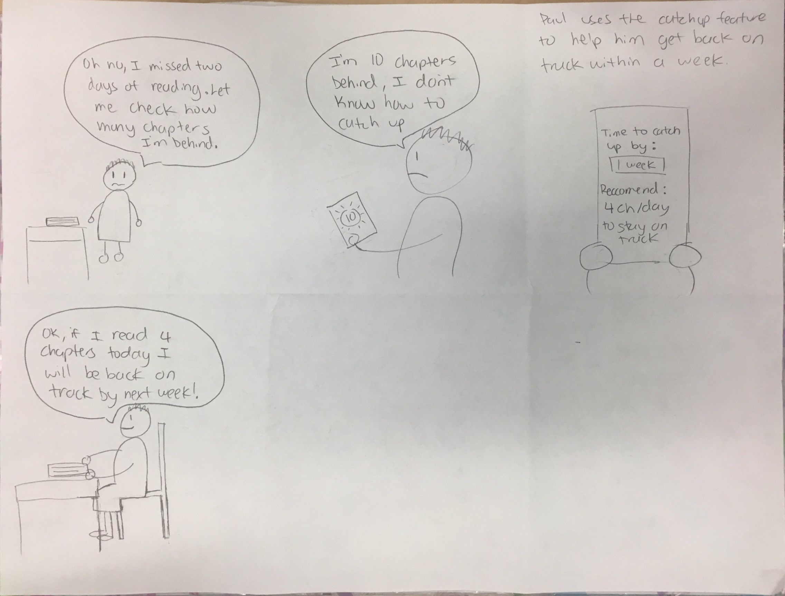

**Description**: The person in this story has fallen behind in their daily plan to read the bible. The solution might not be to try and read it all at once because they have other things in their lives to do. So one solution is to help overlay their catch-up reading into their current reading which the app will be able to calculate and allow the user to input the chapters.

## Paper Prototype #1: ##
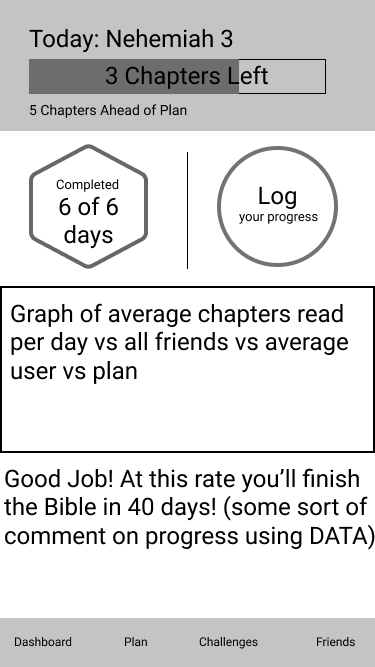
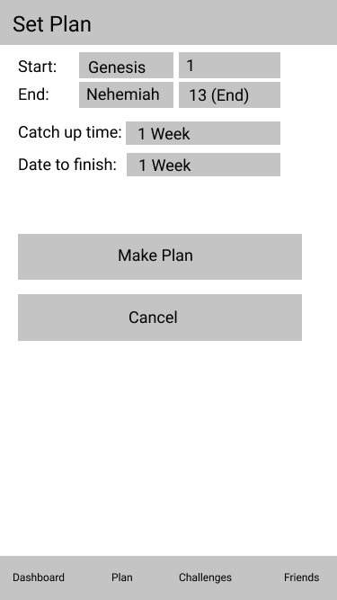
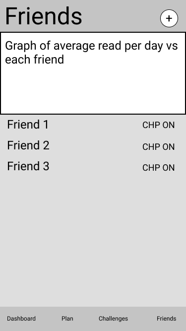
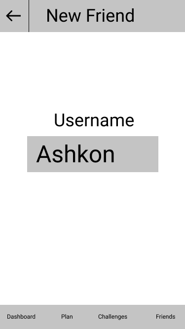

**Description**: For this prototype, we decided to focus more on the aspect of having a dashboard
that would notify the user of different things, as well as helping to build a plan. There is 
a slight social aspect to this one with some graphs but we didn't focus too much on designing that because we wanted this paper prototype to be more focused on the plan aspect and trying to keep the person on track with what they wanted to do. Not too much about social but rather just for a person to have more focus on keeping up with their own plan.

## Paper Prototype #2: ##
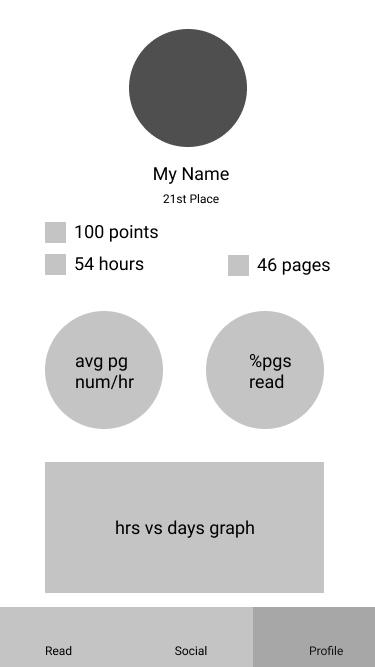
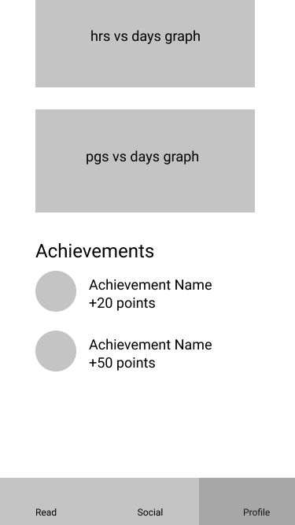
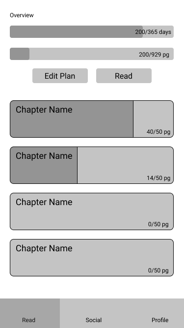
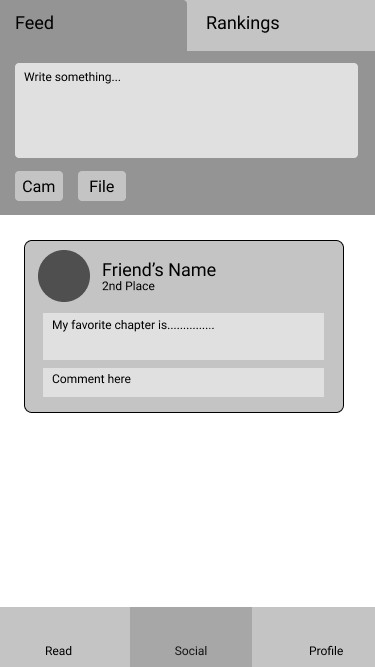
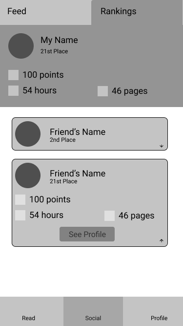

**Description**: For this paper prototype, we wanted the focus to be on the competition aspect
moreso than keeping on track with a set plan. Instead there are achievements, a ranking system and
even a sharing tab that will help people show accountability. Through this paper prototype, we want the goal to be setting motivation for people as a game rather than just trying to keep up with things.

